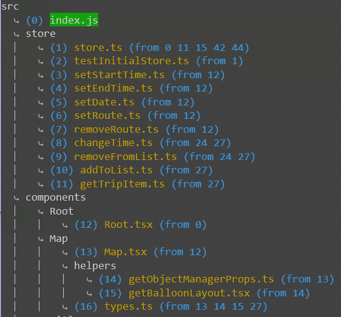

# Import Viewer

Shows all `tsx` and `ts` imports made from a specific file in a file system view. Package should be useful
for UI developers to track bundle size and control bundle imports.

### How to use

You should install package globally

```
npm i import-viewer -g
```

and launch it from your package root folder

```
import-viewer <path from root>
```

You can copy `path from root` with the help of WebStorm for example.

For example, in one of my projects, using

```
import-viewer src/index.js
```

you will get this output



Start file is marked green and has 0 index. Each file starts with index, filename and indexes of files
it is imported from. All output starts from project folder and repeats file structure.
Package tracks down only `tsx` and `ts` files. It stops tracking for files in `node_modules`.
If file contains platform keyword: `['@touch-phone', '@touch-pad', '@touch', '@desktop', '@common']`,
keyword will be bolded out, because it is crucial part of import tracking in big projects with
multiple platforms.
